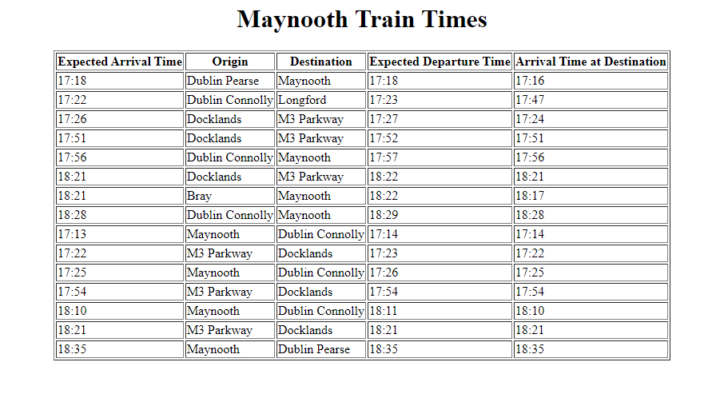

# TrainTimes
A java program which uses the Irish Rail Realtime API to fetch the xml feed for a stop specified by its ID, in my case MYNTH/Maynooth.
It parses the data and displays the train times in a table as a HTML page with Expected Arrival Time, Origin, Destination, Expected Departure Time, Arrival Time at Destination.

